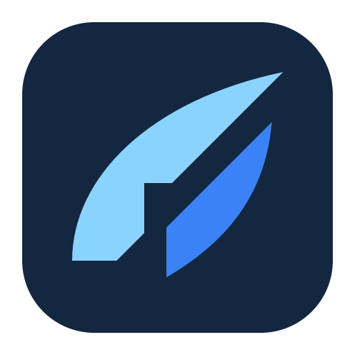

# Bluewing identity



Bluewing turns construction plans into measured geometry, authored construction, and explainable quantities. Its ordinary workflow is PDF import, calibration, drawing lengths/areas/counts, applying calculations, inspecting sources, and exporting an estimate. The identity should feel precise, dependable, and useful in the compact dark workspace described in the [restart brief](restart-brief.md). AI assistance operates the same product through its CLI; it is not the central visual metaphor.

The mark is a **constructed wing**: two swept blue planes separated by an open diagonal joint. Curved outer edges give it a wing silhouette, while the squared inner step and measured cut connect it to drafting and construction. Its single gesture relates to the name without illustrating the entire estimating workflow.

## Research and decisions

These guides informed the process and the concrete decisions below. They are references for design reasoning, not sources of artwork.

| Guide or tutorial                                                                                                                                                                                                           | Lesson applied to Bluewing                                                                                                                                                                                       |
| --------------------------------------------------------------------------------------------------------------------------------------------------------------------------------------------------------------------------- | ---------------------------------------------------------------------------------------------------------------------------------------------------------------------------------------------------------------- |
| [David Airey: Logo design tips from the field](https://www.logodesignlove.com/logo-design-tips)                                                                                                                             | Develop the idea in black first, fit the audience, and leave one memorable feature. The open joint carries the design; construction does not require a literal building or ruler.                                |
| [Adobe: Three Techniques for Unforgettable Logos](https://blog.adobe.com/en/publish/2017/08/08/techniques-for-unforgettable-logos)                                                                                          | Michael Flarup connects the story to the subject; Aaron Draplin checks geometric consistency and tiny reproductions; Brian Barrus advocates iteration. We explored multiple silhouettes before adding color.     |
| [Adobe / Brian Wood: Build your logo with basic shapes](https://www.adobe.com/learn/illustrator/paths/branding-and-identity/illustrator/series/graphic-design/make-a-logo/illustrator/in-app/make-a-logo-start-with-shapes) | The hands-on tutorial builds artwork from polygons, modified anchors, selected corners, and subtracted shapes. Bluewing uses two editable filled paths combining swept curves with a squared joint.              |
| [Adobe: Simplify your logo design process](https://helpx.adobe.com/ro/illustrator/how-to/build-logo.html)                                                                                                                   | Combine and subtract simple shapes, then export the artwork at the required sizes. A single SVG master feeds the export script.                                                                                  |
| [Noun Project: What Makes a Great Icon Set?](https://blog.thenounproject.com/what-makes-a-great-icon-set/)                                                                                                                  | Establish subject and style, preserve consistent weight and spacing, and inspect small sizes. Broad planes and an open gap replace feather detail and blueprint ticks.                                           |
| [Noun Project: Minimalism vs. Detail](https://blog.thenounproject.com/minimalism-vs-detail-finding-the-right-balance-in-icon-design/)                                                                                       | Details must serve the purpose and context; details that disappear at normal sizes are expendable. The app icon contains no lettering, grid, texture, or decorative symbols.                                     |
| [IBM: UI icon design](https://www.ibm.com/design/language/iconography/ui-icons/design/)                                                                                                                                     | Use a grid to guide proportions, padding, angles, and visual weight, while allowing adjustments for the shape. The diagonal joint uses parallel 45-degree edges; optical judgment remains part of placement.     |
| [IBM: App icon design](https://www.ibm.com/design/language/iconography/app-icons/design/)                                                                                                                                   | Objective or abstract forms can express a product, and apparent centering can require adjustment. Bluewing's placement balances the visible mass of its unequal wing planes.                                     |
| [IBM: 8-bar logo](https://www.ibm.com/design/language/ibm-logos/8-bar/)                                                                                                                                                     | Its positive and reversed artwork demonstrates that equal geometry can look unequal on different backgrounds. Inspect light and dark reproductions instead of assuming a large vector preview proves legibility. |
| [Microsoft: Design guidelines for Windows app icons](https://learn.microsoft.com/en-us/windows/apps/design/iconography/app-icon-design)                                                                                     | Keep a strong silhouette, limit competing metaphors, and check both light and dark backgrounds. The flat navy tile provides a consistent background for the two blue planes.                                     |
| [Apple: App Icon Design, WWDC17](https://developer.apple.com/videos/play/wwdc2017/822/)                                                                                                                                     | The design tutorial emphasizes a simple, recognizable central idea. Its conceptual guidance informs the mark; Tauri's current desktop format requirements determine the exports.                                 |

IBM's exact brand rules are specific to IBM; their grid and optical examples inform the method, not Bluewing's colors or prescribed dimensions.

Silhouette studies explored feathers, parallel strips, folded planes, angular letterforms, and a B monogram. A purely angular direction looked too close to the sharp geometry of the [Autodesk symbol](https://brand.autodesk.com/visual-system/logo-system/), prompting the swept outer contours. A solid feather suggested a quill, several angular variants read as F, and the B had narrow counters. The final design pairs two related curves with one squared drafting joint: a clearer wing silhouette with a compact construction detail.

## Editable artwork

The source is [assets/brand/bluewing.svg](../assets/brand/bluewing.svg). It is authored vector geometry, with no embedded raster image, text glyphs, fonts, filters, gradients, or effects. The title and description provide metadata; they are not visible lettering.

| Element        | Definition                                                                  |
| -------------- | --------------------------------------------------------------------------- |
| Canvas         | `512 × 512` viewBox                                                         |
| Navy tile      | `#142740`; `(32, 32)`, `448 × 448`, corner radius `104`                     |
| Leading plane  | `#8bd3ff`; path `M104 376C104 256 216 144 408 104L248 264H208V336L168 376Z` |
| Trailing plane | `#3b82f6`; path `M256 312L392 176C384 272 336 344 240 400V328Z`             |
| Placement      | Coordinates are set directly in the viewBox; no group transform             |

The master includes transparent outer space and clearance between the wing and tile. Preserve those proportions when exporting; extra padding will make small icons unnecessarily weak. The tile keeps both blue planes legible against varied application and desktop backgrounds. Parallel 45-degree edges keep the open diagonal joint consistent, while the curved contours give the mark its sweep.

For a monochrome mark, remove the `tile` rectangle and give both paths the same solid fill suited to the background. Preserve the gap and proportions. There is no separate monochrome asset to keep synchronized. Do not stretch the SVG, add tiny scale markings, or put text inside the icon.

## Regenerate the icons

After editing the source, run from the repository root:

```sh
bun run icons:generate
```

[scripts/export-icons.ts](../scripts/export-icons.ts) uses the installed Tauri CLI to rasterize the SVG and build native icon containers, following [Tauri's app icon guide](https://v2.tauri.app/develop/icons/). It generates into a temporary directory, copies only the desktop and browser assets used here, and removes the temporary files. Edit the source rather than generated copies. The generator can reorder ICNS entries between runs; the decoded images remain the same, even when the container's binary hash changes.

| Generated location | Assets and purpose                                                                               |
| ------------------ | ------------------------------------------------------------------------------------------------ |
| `src-tauri/icons/` | `32x32.png`, `128x128.png`, `128x128@2x.png` (256px), and `icon.png` (512px); desktop PNG assets |
| `src-tauri/icons/` | `icon.ico` for Windows and `icon.icns` for macOS                                                 |
| `public/brand/`    | `bluewing.svg`, copied from the source for web use                                               |
| `public/brand/`    | `favicon.ico`, `favicon-16.png`, and `favicon-32.png`; browser tab icons                         |

For an additional export without changing the normal asset set:

```sh
bun x --no-install tauri icon assets/brand/bluewing.svg --output output/brand --png 768
```

This produces `output/brand/768x768.png`. No image generation service is required. This work adds no mobile icon integration, installable PWA manifest, or new platform support.

When revising the geometry, inspect the exported files at actual 16, 20, 24, 32, and 48px sizes, plus a large preview. Check the silhouette, open joint, color separation, and optical placement on light and dark surfaces. A large SVG preview alone is insufficient evidence of a successful small icon.

## Verification on September 28, 2026

The final mark was inspected at 16, 20, 24, 32, 48, 64, and 128px, in monochrome on light and dark backgrounds, and in the application header. Both the header and welcome screen use the exported SVG with fixed display dimensions and decorative alternative text.

- `bun run icons:generate` passed. The PNGs and ICO/ICNS containers decode successfully. ICO includes 16, 24, 32, 48, 64, and 256px; ICNS includes standard and Retina entries through 1024px.
- The exporter also bundled with `bun build scripts/export-icons.ts --target=node --packages=external --outfile=tmp/export-icons.mjs` and ran with `node tmp/export-icons.mjs`. Keep that output one directory below the project root, as the script resolves the source relative to its own location.
- `bun run check` passed: TypeScript, ESLint, and formatting.
- `bun run test:dev tests/browser/workspace.dev.spec.ts tests/browser/compact.dev.spec.ts` passed all four Chromium/WebKit checks, including Solid diagnostics.
- `bun run build` passed. Vite reported the existing large JavaScript chunk warning.
- `bun run test:production tests/browser/workspace.production.spec.ts tests/browser/compact.production.spec.ts` passed all four Chromium/WebKit checks.
- `bun run desktop:build` could not finish because the running Bluewing process held `src-tauri/target/release/bluewing-desktop.exe` open. The existing session was left running. Windows installer verification and macOS runtime appearance remain unverified.

No new dependencies or regression tests were added. Additional handling is limited to temporary-export cleanup, a fresh CLI process per export to avoid Tauri's repeated logger initialization warning, and ICO/PNG browser fallbacks alongside SVG. No new product gates or compatibility layers were introduced.
