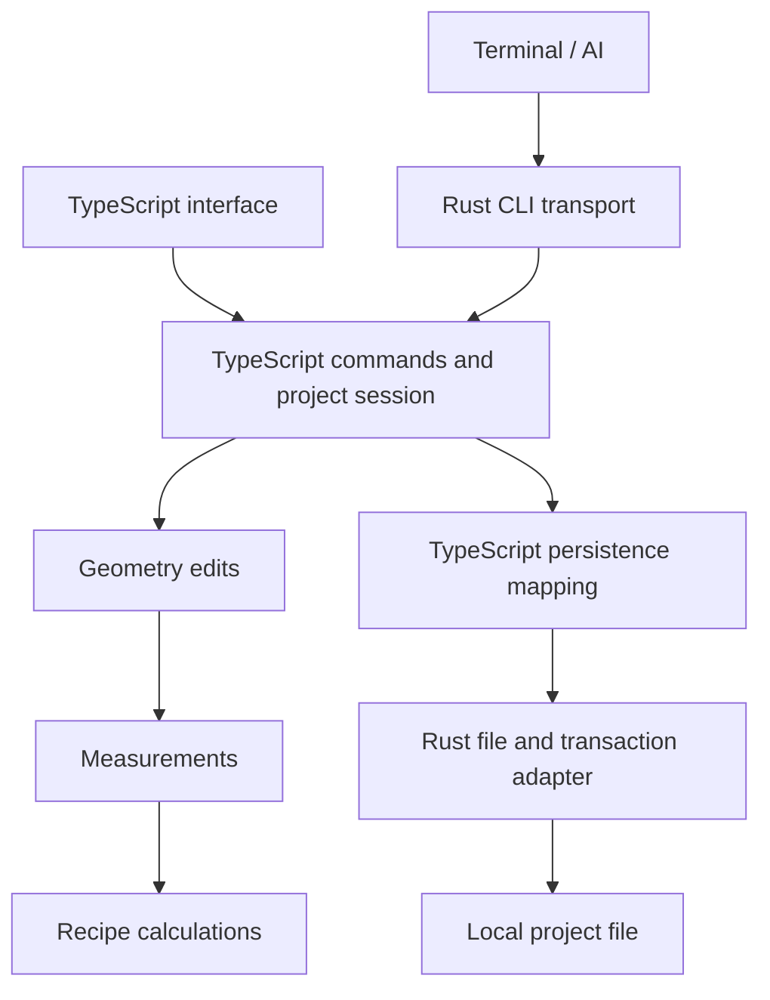

# Bluewing restart brief

Restart direction and MVP decisions, September 16, 2026. Implementation recommendations are identified separately from confirmed product choices.

Build a small, dependable takeoff application whose ordinary features can be developed and delivered as a web application. The first users are a small group working in the desktop app with AI assistance through its CLI. Progress means completing real estimating workflows and being able to change them without breaking unrelated behavior.

The previous PlanVyper application is a reference. **Its code, documentation, tests, and architecture are not authoritative, necessarily correct, or necessarily the best approach.** Use it to recover useful behavior and visual decisions. Resolve disagreements using the new product decisions and independently checked examples.

**Decision status.** Confirmed directions are TypeScript application logic, SolidJS 2 with an exact-pinned toolchain, a small Rust native adapter, web application updates, a desktop-dependent CLI, independent geometry with snapping, flat reusable groups with recipe assignments, session undo/redo with reliable saving, and reuse of the interface design. Calculations include editable formulas, inputs with declared types and units, multiple outputs, source explanations, waste allowances, and whole-package rounding. Layers, nested groups, detailed construction-piece layouts, and recipe publishing/version migration are deferred. Other MVP cuts below are recommendations.

## A small useful MVP

Complete this workflow: create a project, import a PDF, choose and calibrate a sheet, draw lengths/areas/counts, apply a simple calculation, inspect its sources, export quantities, close, and reopen. An agent can inspect the same project and make the same edits through the CLI while the desktop app shows the results.

The first usable MVP targets macOS. Windows follows after the macOS workflow is usable and verified.

Initial scope:

- One open project session, multiple sheets, local project storage, and one base calibration per sheet.
- Paths, explicit area polygons, and count markers; selection, point editing, move, copy, and delete.
- Reusable groups with editable recipes, traceable quantities, waste allowances, whole-package rounding, and CSV/JSON export.
- One command path for UI and CLI, reliable saving, and session undo/redo.
- The existing layout adapted to these features, with offline use after the web application has been installed/cached.

Confirmed deferrals include automatic shared junctions, Layers and nested groups, a permanent historical timeline, detailed placement of construction pieces, and recipe publishing/version migration. Also recommended for later are automatic room finding, scale regions, overlays, alternate estimates, collaboration, and cloud project synchronization. Add these when a real workflow requires them, without implementing placeholder systems in advance.

## Ownership and runtime

TypeScript owns all product behavior, including commands, geometry, measurement, calculation, undo, persistence mapping, schema migrations, CLI command definitions, rendering, and update orchestration. It runs in the native shell's webview. A separate Node/Bun runtime is unnecessary for the MVP.

Rust owns native capabilities: windows and menus, file dialogs, authorized file access, database connections and atomic transactions, the terminal connection, and any native bootstrap needed to load cached web assets. It does not understand walls, recipes, takeoff commands, or calculation history. A small CLI launcher is part of this adapter and ships with the desktop app.

These are responsibilities within one application, not a requirement for separate services or packages. Start with a small TypeScript codebase organized by these responsibilities. The geometry and calculation modules should work on plain data without importing UI stores, SQL, or Tauri.

The application session owns accepted project state. The UI owns selection, camera, panel layout, and unfinished input. A draft becomes project data through a command; pointer movement does not save a command. Derived measurements and quantities come from the core, including the values displayed in inspectors.

## Geometry: describe the drawing

**Confirmed simplification: independent objects with snapping.** A path owns its ordered points, an area owns its polygon, and a count set owns its markers. Snapping aligns coordinates without creating a hidden relationship. Moving a point changes its object; an explicit multi-object selection can move several objects together. Areas are drawn directly instead of being inferred from a shared edge graph.

Geometry belongs to a sheet and remains valid without any group membership. The same geometry ID can supply several calculations, so a shared wall can be measured once and used for several materials. Removing a membership, recipe assignment, or group leaves the geometry intact.

Use stable page coordinates independent of zoom, pixel density, and physical calibration. Choose and document a single origin/orientation convention at import, and retain the transform needed to relate original page coordinates to rendered images. Camera transforms belong to rendering.

The geometry module answers geometric questions: segment length in page units, polygon area, hit tests, intersections needed by current tools, and valid edits. It does not decide construction quantities. Start with simple valid polygons; holes and shared junctions can become explicit additions when required.

## Measurement: convert drawing into physical facts

Measurement combines geometry with sheet calibration. It supplies typed length, area, perimeter, and count metrics to both the UI and calculations. Keep units explicit, convert through a consistent internal convention, and round for display or a specified calculation rule rather than during each geometric step.

Changing calibration changes derived measurements, not stored points or object IDs. Uncalibrated geometry is still drawable and editable. Counts remain valid; physical lengths and areas are unavailable until calibrated. An unavailable measurement is not zero.

Sheet scale setup defaults to the printed scale: architectural/metric presets, then a custom paper-to-real ratio. Two-point measurement is the secondary choice for a known dimension. Opening setup never changes calibration; apply the selected scale explicitly. Reopening shows the existing scale, including custom or measured values. Ratio conversion uses the imported PDF's paper size, independent of canvas zoom.

A later scale-region implementation can extend measurement without changing geometry ownership. That boundary is the preparation needed now; region partitioning and precedence rules can wait.

## Calculation: explain quantities from measurements

**Reusable groups with recipe assignments are essential to the MVP.** Keep three concepts explicit: a geometry object describes the drawing, a group references a set of geometry IDs, and a recipe assignment attaches a recipe and its inputs to that group. Geometry can belong to zero, one, or several groups. Membership is unique within a group. Groups can be empty and can hold several recipe assignments.

For example, one wall can belong to an assembly group for framing and insulation and a second group for an additional finish. Both reference the same wall. Their distinct assignments intentionally contribute quantities; matching geometry IDs across groups are not a reason to discard one calculation. Deleting geometry removes its memberships as part of the same undoable command. Deleting a group removes its assignments and memberships while preserving the drawing.

**Confirmed simplification: flat named groups, with Layers and nesting deferred.** The proposed organization is project-level groups that can reference geometry on several sheets. Alternate-estimate relationships can follow. A group name and optional highlight color are organization and presentation; they do not control geometry ownership or whether an object exists. Duplicating a group can copy its assignments and memberships while retaining references to the same geometry.

A recipe consumes measured metrics and explicit inputs, then returns outputs with units and an explanation. Keep recipe definitions as project data. **The confirmed authoring scope includes editable named inputs and formulas, multiple outputs, units/dimension checks, and source explanations.** Use a constrained evaluator over declared metrics and inputs, with ordinary arithmetic and useful functions such as rounding, minimum/maximum, and conditions.

The MVP calculates material amounts from measurements. It defers figuring out the physical arrangement of individual construction pieces:

| Job           | Included in the MVP                                                                                | Deferred                                                                                                |
| ------------- | -------------------------------------------------------------------------------------------------- | ------------------------------------------------------------------------------------------------------- |
| Drywall       | Calculate wall area and material layers, allow for waste, and round the amount up to whole sheets. | Place individual sheets, work out cuts and seams, or reuse offcuts.                                     |
| Wall framing  | Estimate stud quantities with a formula using wall length and spacing.                             | Place individual studs and resolve their arrangement around corners, intersections, doors, and windows. |
| Ceiling tiles | Calculate area, estimate tile quantity, allow for waste, and round to whole packages.              | Lay out a grid and derive full/cut tiles, rails, and hangers from that layout.                          |

A formula estimate does not claim the same accuracy or detail as a piece layout. The old code calls the deferred layout algorithms "generators."

Initially evaluate each assignment against each compatible group member, retaining the source result before summing compatible outputs. Height, spacing, and similar estimating inputs belong to the recipe assignment rather than the drawing's points.

**Waste allowances and whole-package rounding are included.** Start with a percentage allowance and an optional quantity per package for each output, using recipe defaults that can be changed on the group's assignment. The initial calculation order is: sum the members' base amounts for that assignment/output, add the waste allowance, then round up to whole packages. Package rounding happens at that group assignment/output level, rather than separately for each drawn object. Combining purchases across groups or optimizing cuts is deferred.

For example, 100 sq ft of calculated material plus 10% waste gives 110 sq ft. At 32 sq ft per sheet, the order is 4 sheets covering 128 sq ft. Show the base amount, waste allowance, package count, and purchased coverage separately. Retain each object's base contribution; the extra allowance and package rounding belong to the group result. Advanced scrap formulas and stacked override rules from the old app are not required for this first implementation.

Calculations never mutate authored geometry. A future piece-layout calculation can return quantities or a proposed arrangement. Accepting that arrangement as editable drawing objects would be an explicit command, keeping calculated results separate from user-authored geometry.

Project recipes are independent copies of any starter library. Updating the app or starter library does not silently replace a project's recipe definition. Editing a project recipe updates the groups using it through one undoable command; Undo restores the previous recipe. Keep ordinary editable project recipes in the MVP. Defer publishing, archiving, pinned recipe revisions, and choosing which assignments migrate to a newer revision.

Use a single calculation path for the inspector, quantity table, export, and CLI. Results retain the group, assignment, geometry source, recipe, effective inputs, output unit, and diagnostic. Sum compatible outputs; preserve different units and material identities. An invalid calculation remains visible and makes affected totals incomplete instead of quietly contributing zero.

Example expectations to retain as independent checks: a 24 ft wall at 8 ft high with two layers gives 384 sq ft; a 24 by 15 ft rectangle gives 360 sq ft; three markers give 3 items. These examples establish arithmetic, not every construction rule.

## Commands, saving, and history

One TypeScript command registry supplies validation, execution, CLI help, and payload schemas. Both UI and CLI submit semantic commands through a serial queue. Each accepted command validates against current state, creates a change, persists it atomically, and then publishes the accepted state. Failed persistence does not report success or discard the user's draft.

Commands based on an earlier observation carry the project identity and expected revision. A stale request returns a clear conflict so the caller can inspect and retry. A single process simplifies ownership but does not eliminate stale AI observations or UI drafts.

**Confirmed simplification: session undo/redo.** Keep a bounded stack of before/after changes for affected records, with an action label and origin. UI and CLI actions share this stack. One completed drawing gesture or atomic batch is one undo step. Undo and redo use the same saving path and advance the project revision. Closing the project clears the stack; the current saved state remains.

Store the current project, not an event-sourced reconstruction of every past entity. A future checkpoint feature can save named project states without requiring a permanent timeline now. Reliable saving and crash recovery are separate from retaining every historical edit.

SQLite is a reasonable proposed container for current records and imported source assets. Keep SQL mapping and migrations in TypeScript; Rust executes generic, bounded transactions on an opened project connection. Ordinary edits update affected records without copying PDFs or all history. Use one writable application session per project in the MVP. Opening the same project in another writer is outside that scope.

The implementation uses a `.bluewing` SQLite container with format version 1. TypeScript maps project metadata, individual records, and separately stored PDF assets. Native file locking enforces one writer. Browser development uses IndexedDB through the same persistence interface; the desktop file remains the deliverable project format.

Version the new project format. Importing old project files is a separate need to confirm, not a reason to inherit the old database schema. Add explicit migrations when the new model evolves rather than building representations for unimplemented future features.

## CLI: operate the desktop project

The CLI is a required product interface from the first working workflow. Its launcher connects to the desktop app, forwards arguments/input, waits for the result, prints structured JSON, and returns an exit status. The TypeScript app interprets product commands. Adding a command or changing its help must not require rebuilding the launcher.

Start with commands for project/sheet inspection, geometry reads and edits, groups and memberships, recipe assignments, quantities/explanations, undo/redo, export, and bounded image rendering. Provide examples and machine-readable schemas from the same command registry. Agent images include sheet identity, bounds, and coordinate mapping so their pixels can be related to edits.

An atomic batch contains ordinary commands and validates the resulting project as a unit. A preview can execute against a temporary in-memory state without committing. Both use the same command logic. The scope is the active desktop project; the CLI does not open a second independent database session.

For the simplest first implementation, return an actionable error if the desktop app is unavailable. Automatically opening the app can be a later convenience. Keep the terminal connection local and limited to the current user's application session.

## Interface: retain the useful design

Use the current SolidJS interface as the visual reference: dark canvas-centered layout, left sheet navigator, right contextual inspector, tool rail at the far right, collapsible panels, and a bottom status bar. Retain its density, spacing, colors, keyboard affordances, and panel behavior where they help the smaller workflow.

Initially expose the drawing and quantities workspaces, with groups accessible from navigation and recipe assignments in the contextual inspector. A session undo stack does not require the existing History workspace. Hide deferred features instead of building inactive navigation around them.

**Compact functionality takes priority.** The user's PlanSwift reference (`2998.jpg`) calls for a dense sheet/group tree with one-line rows, clear indentation, measured totals, color swatches, visibility controls, and a compact search. Keep the modern styling while making common work available directly in those rows. Full-canvas crosshairs follow the mouse; general navigation help belongs in the status bar, leaving the plan unobstructed.

Visibility is local view state, saved per project on the device. A sheet control hides its takeoff drawing while leaving the PDF visible; a group control applies to that group on that sheet. Hidden geometry is excluded from selection and snapping, but retains its measurements and contributions to the estimate. Shared geometry remains visible through any visible group; ungrouped geometry follows the sheet control. Drawing into a hidden group or following a quantity source reveals the relevant drawing.

Review components individually before copying them. Presentation components and CSS are stronger reuse candidates than the canvas controller, project stores, or native projections. A component can preserve its appearance while receiving new, smaller inputs and actions.

Keep one drawing implementation for the MVP and reuse its geometry/measurement conventions for CLI images. Browser development should execute the actual TypeScript core through a small development storage adapter, rather than a separately maintained read-only mock application. Shipping full browser-only project storage is a later decision.

The September 17 UI review confirms source-page previews on hover or keyboard focus, groups shown beneath each sheet containing their members, ordinary wheel zoom toward the pointer, and draggable panel dividers. Group nesting in the navigator is a projection of flat reusable groups, not a hierarchy in project data. Preserve the reference's compact rows, sheet/group search, sheet-local group selection, contextual selection measurements, and separate next-drawing group choice. Panels collapse, temporarily peek, pin, and retain device-local widths. Resizing and navigation preserve the drawing view. See the [UI restoration record](ux-restoration.md) for provenance, implemented details, and historical behaviors intentionally left out.

## SolidJS 2 and agent tooling

**Confirmed framework choice: SolidJS 2.** At setup on September 16, 2026, the newest published Solid 2 version was `2.0.0-rc.8`; stable 2.0 had not been released. This is the initial pin. The npm `latest` tag still selected Solid 1, and related packages had different tag defaults, so resolve concrete compatible versions rather than installing a tag across the package set. See the [RC.8 release](https://github.com/solidjs/solid/releases/tag/solid-js%402.0.0-rc.8).

Treat the runtime, renderer, JSX compiler, diagnostics, and integrations as one compatibility boundary. Bun is the package manager and command runner for development and CI. Exact-pin direct dependencies, constrain the transitive Solid compiler/runtime packages, and keep `bun.lock` under version control. Use `bun install --frozen-lockfile` in CI. Upgrades, including eventual adoption of stable 2.0, are deliberate changes with release-note review and development and production verification. Unrelated feature work preserves the existing pins.

The repository includes substantial linting: strict type-aware TypeScript rules, Solid 2 rules, JSX accessibility checks, and formatting. Use Solid 2-aware rules rather than presets that recommend removed Solid 1 APIs. The [repo skill](../.agents/skills/solidjs-2/SKILL.md) records likely agent mistakes and the workflow for diagnosing them. Package versions and enabled rules are owned by the package manifest, lockfile, and configuration files.

Use `@solidjs/diagnostics` in development and CI. Give important UI stores, signals, memos, and effects meaningful names so artifacts identify the source of a rerun or wait. Browser scenarios should assert visible behavior and inspect diagnostics, silent holds, and justified rerun budgets. Preserve artifacts for failures. A silent hold needs visible pending feedback; increasing a budget alone does not repair it. Introduce scenario budgets for actual interactions, without imposing arbitrary timing thresholds across the application.

Run development checks before the production build and browser smoke checks. RC.8 also supports an observe build, but it omits some development checks, so it does not replace development verification. Bluewing starts as a client-rendered application; SSR and SSR tests are not required for this desktop workflow. Chromium and WebKit checks supplement the later native app checks.

Development checks include sheet-panel toggling and an estimating workflow through PDF import, calibration, drawing, recipes, quantities, export, and reopening. Native checks exercise the desktop bridge, SQLite, CLI image rendering, and complete cached web-version activation. See [repository setup](../README.md) for commands and the separate validation scopes.

## Web application updates

The deliverable is a remotely updatable PWA-style application inside a native Rust shell. A web release includes the UI, domain code, CLI definitions, recipes shipped as defaults, rendering assets, and application migrations. Native releases are reserved for changed native capabilities and dependencies.

Tauri can load a remote URL and permit an explicit origin to call selected native APIs. Neither setting provides offline delivery on its own. See [Tauri asset configuration](https://v2.tauri.app/reference/config/#frontenddist) and [remote API access](https://v2.tauri.app/security/capabilities/#remote-api-access).

Keep a complete usable web version locally. Download the next version as a complete unit and activate it between project sessions, after saving and resolving unfinished work. If the download is interrupted, continue using the previous version. A web release declares its required bridge version; project schema migrations belong to the web release. A code rollback must not be assumed to undo a data migration.

Prove the delivery mechanism in the target native webviews early. Service workers are a possible cache mechanism, but their support and lifecycle in the shell need verification. If necessary, use a small native cache/loader for web bundles while keeping product and update policy in TypeScript. Choose one mechanism for the MVP. [Service worker lifecycle](https://developer.mozilla.org/en-US/docs/Web/API/Service_Worker_API/Using_Service_Workers) and [Tauri's webview process model](https://v2.tauri.app/concept/process-model/) describe the relevant platform boundaries.

## Keep the reference outside the new application

Maintain sibling directories for the new application and the frozen reference. The reference is neither a workspace dependency nor a default instruction source. Copy this brief and its [reference map](restart-reference-map.md) into the new project; consult only the map entries relevant to the task at hand.

The map uses paths relative to the reference repository, so it travels between machines. It also identifies the assessed checkpoint: the ordinary Git checkout was older than the tested source. Preserve a normal source snapshot of that checkpoint, rather than making the new project depend on the old tooling to recover it.

Write new product decisions into this brief in place. Historical specs remain evidence of prior choices. When reusing code, keep the smallest useful piece and understand its assumptions before importing dependencies around it.

## Build order and evidence of progress

1. Make the shell load the web app, execute a CLI request in TypeScript, and save/reopen a tiny project. Demonstrate a second web version without rebuilding Rust, then start offline.
2. Complete one real workflow through both UI and CLI: import, calibrate, draw a wall, assign it to a group, apply a recipe, calculate, inspect, export, undo, and reopen. Include a waste allowance and package rounding with independently expected results. Reuse that wall in a second group and verify its independent contribution.
3. Add area and count workflows. Use representative source plans and independently expected quantities, including an agent image-and-edit loop.
4. Change a persisted property and a calculation command. Observe which modules change and whether unrelated behavior breaks before expanding the feature list.

Use focused domain examples and a few complete workflows to check these boundaries. Test the actual native app as well as the browser development view. Do not infer readiness from the number of generated tests or implemented command names.

Use the local Behavioral Health Group permit set dated March 27, 2026 as a real import/rendering reference. It has 15 sheets, including the A2.0 new-work floor plan. The source PDF is in the user's Downloads directory and is not committed to the repository. It supplements the independent wall, area, count, and package-rounding examples; it is not a complete MVP acceptance specification.

Keep the project in Git and save useful working checkpoints after the relevant checks pass. The reference repository remains separate.
